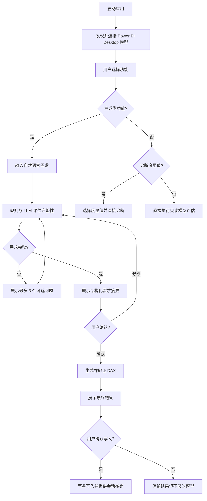
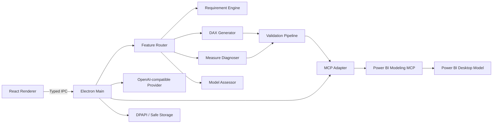

# Power BI 智能助手技术开发文档

| 项目 | 内容 |
|---|---|
| 文档编号 | PBI-AI-TDD-001 |
| 文档版本 | 1.0 |
| 文档状态 | 受控开发基线 |
| 编制日期 | 2026-07-13 |
| 目标平台 | Windows 10/11 x64 |
| 目标产品 | Power BI Desktop 本地智能助手 |
| 发布类型 | 内部测试版 |

## 1. 文档目的

本文档定义 Power BI 智能助手的产品范围、技术架构、功能需求、接口契约、安全规则、测试方案、阶段计划和验收门禁。

本项目必须分阶段实施。任何阶段完成后，均须提交运行版本、测试结果、手工验收步骤和偏差说明，并等待项目负责人确认。未获得确认，不得开始下一阶段，也不得提前混入后续阶段功能。

### 1.1 版本记录

| 版本 | 日期 | 变更内容 |
|---|---|---|
| 1.0 | 2026-07-13 | 建立本地助手、五类功能、需求澄清、DAX 验证、模型诊断、模型评估及分阶段开发基线 |

### 1.2 参考资料

- [Power BI Modeling MCP Server](https://github.com/microsoft/powerbi-modeling-mcp)
- [Power BI Desktop 外部工具](https://learn.microsoft.com/en-us/power-bi/transform-model/desktop-external-tools)
- [Power BI MCP Server 概览](https://learn.microsoft.com/en-us/power-bi/developer/mcp/mcp-servers-overview)
- 项目 DAX 规范：`.agents/skills/dax-expert/SKILL.md`

## 2. 项目概述

### 2.1 建设目标

构建一个可安装的 Windows 本地应用，连接当前用户已经打开的 Power BI Desktop 语义模型，并通过用户自行配置的国产 OpenAI-compatible 大模型接口，提供以下功能：

1. 生成度量值。
2. 生成计算列。
3. 生成计算表。
4. 诊断现有度量值。
5. 评估当前模型。

生成类功能必须先判断业务需求是否完整；不完整时通过多轮可选问题完善需求。诊断和评估功能不做业务完整性判断，选择目标后直接执行。

### 2.2 成功标准

- 所有生成结果只能引用当前模型真实存在的对象。
- 生成类功能必须完成需求摘要确认后才能生成最终代码。
- 诊断和评估功能不得触发业务需求完整性流程。
- 写入模型前必须通过验证并获得用户确认。
- 模型评估保持严格只读。
- 用户无需安装 Node.js 或 .NET 即可运行内部测试安装包。
- 每个开发阶段均可独立测试，并存在明确的停止和验收门禁。

### 2.3 非目标范围

首版不包含：

- Power BI Service 或 Fabric 云端工作区连接。
- 关闭状态 PBIX 文件的直接解析。
- Power Query M 生成。
- 报表页面、视觉对象、主题和书签编辑。
- 通用 `EVALUATE` DAX 查询生成入口。
- 自动修改关系、角色、分区、数据源或刷新策略。
- 模型评估结果的自动修复。
- 自动升级、正式代码签名、商业授权和计费。

## 3. 用户与使用场景

### 3.1 目标用户

- Power BI 报表开发人员。
- 数据分析师。
- 需要编写或诊断 DAX、但缺少高级 Tabular 经验的业务用户。
- 内部测试人员和项目验收人员。

### 3.2 典型场景

| 编号 | 场景 | 预期行为 |
|---|---|---|
| UC-01 | 用户希望生成同比销售额度量值 | 检查日期表、基础度量值、比较周期等信息，必要时提问，确认后生成并验证 |
| UC-02 | 用户希望在客户表增加分组列 | 确认目标表、逐行规则、返回类型和物化用途，提示计算列成本 |
| UC-03 | 用户希望创建日期辅助表 | 确认表粒度、来源、输出列和用途，验证后确认写入 |
| UC-04 | 用户选择一个结果异常的度量值 | 不做需求完整性确认，立即分析表达式、上下文、依赖和实测指标 |
| UC-05 | 用户希望检查整个模型 | 不做需求完整性确认，直接执行只读综合健康检查 |

## 4. 功能路由

### 4.1 功能策略

| 功能标识 | 显示名称 | 需要需求完整性 | 需要目标选择 | 允许写入 |
|---|---|---:|---:|---:|
| `generate_measure` | 生成度量值 | 是 | 否 | 是，确认后 |
| `generate_calculated_column` | 生成计算列 | 是 | 是，目标表 | 是，确认后 |
| `generate_calculated_table` | 生成计算表 | 是 | 否 | 是，确认后 |
| `diagnose_measure` | 诊断现有度量值 | 否 | 是，目标度量值 | 否 |
| `assess_model` | 评估当前模型 | 否 | 否 | 否 |

### 4.2 总体流程



## 5. 功能需求

### 5.1 Power BI 连接与 Schema

#### FR-CON-001 模型发现

- 应用应发现当前用户已打开的标准 Power BI Desktop 模型。
- 仅有一个模型时自动连接；存在多个模型时显示选择器。
- 未打开模型时显示明确引导，不启动 LLM 业务流程。

#### FR-CON-002 模型快照

- 连接后读取表、列、数据类型、度量值、DAX 表达式、关系、日期表、格式、显示文件夹、描述和必要模型统计。
- 快照必须生成稳定哈希，用于判断生成或写回期间模型是否变化。
- Desktop 关闭、重开或模型切换时必须使旧快照和旧草稿失效。

#### FR-CON-003 Schema 真实性

- 所有传入 LLM 的模型对象均来自当前 `ModelSnapshot`。
- LLM 返回的表、列和度量值必须在本地对象注册表中再次验证。
- 无有效 Schema 时禁止生成 DAX。

### 5.2 需求完整性引擎

#### FR-REQ-001 触发范围

- 仅生成度量值、计算列和计算表启用完整性检查。
- 诊断现有度量值和模型评估必须绕过完整性检查。
- 目标对象选择属于操作前置条件，不视为业务需求完整性提问。

#### FR-REQ-002 混合判断

- 本地规则引擎检查硬性字段。
- LLM 识别自然语言中的歧义、矛盾和隐含业务条件。
- 即使 LLM 返回“完整”，硬性字段缺失时仍须继续提问。

#### FR-REQ-003 问题交互

- 每轮最多显示 3 个最高优先级问题。
- 每个问题提供 2–5 个答案选项。
- 支持单选、多选和自定义答案。
- 推荐项必须显示推荐理由。
- 推荐值只有在用户主动选择后才能记录为假设，不得静默采用。
- 表、列、度量值等模型对象选项必须从 `ModelSnapshot` 确定性生成。

#### FR-REQ-004 状态与摘要

- 状态流转：`collecting → ready_for_confirmation → confirmed → generating → completed`。
- 需求摘要至少包含业务目标、粒度、输入对象、聚合或逐行逻辑、筛选、排除项、时间口径、返回类型、目标对象和假设。
- 用户修改答案或摘要后，旧的生成结果和验证报告必须失效。
- 确认摘要后冻结需求版本；生成结果必须引用该版本。

#### FR-REQ-005 防重复和冲突

- 系统应记录已问问题、答案和字段来源，避免重复提问。
- 用户回答与已有信息冲突时，优先展示冲突确认问题。
- 无法解析自定义答案时保留原文并重新生成针对性问题，不得丢弃用户输入。

### 5.3 生成度量值

#### FR-MEA-001 完整性字段

至少确认：

- 业务指标定义。
- 可映射的基础列或基础度量值。
- 聚合或计算方式。
- 对结果有影响的筛选、排除项和计算粒度。
- 使用时间智能时的日期列、比较周期和日历口径。
- 分母为零、空值或无数据时的预期行为。

#### FR-MEA-002 DAX 规范

- 优先复用已有基础度量值。
- 列使用 `Table[Column]`，度量值使用 `[Measure]`。
- 比率必须使用 `DIVIDE`。
- 使用 `VAR` 消除重复表达式并明确求值位置。
- 可用列谓词时避免整表 `FILTER`。
- 时间智能必须依赖合格且已标记的日期表。
- 嵌套迭代器必须检查上下文转换是否真实发生。

### 5.4 生成计算列

#### FR-COL-001 完整性字段

至少确认：

- 目标表。
- 一行代表的业务对象。
- 逐行计算逻辑和源字段。
- 期望数据类型与空值规则。
- 必须物化的用途，例如关系、切片器、轴或排序。

#### FR-COL-002 设计警告

- 如果结果仅用于聚合，系统应建议使用度量值。
- 用户仍要继续时，必须在摘要中确认计算列的内存和刷新成本。
- 生成逻辑必须按行上下文解释，不得将筛选上下文与行上下文混淆。

### 5.5 生成计算表

#### FR-TAB-001 完整性字段

至少确认：

- 目标表名称和业务用途。
- 一行代表的粒度。
- 来源表、来源列和筛选规则。
- 输出列及其预期类型。
- 唯一键或去重要求。
- 预期关系、切片器或辅助建模用途。

#### FR-TAB-002 风险提示

- 写入前展示预计刷新和内存风险。
- 不得自动创建关系、角色或刷新策略。
- 结果可能产生大表时必须显示高风险警告。

### 5.6 诊断现有度量值

#### FR-DIA-001 启动条件

- 用户选择现有度量值后立即执行。
- 可选填问题现象和代表性筛选条件，但不得因此阻塞诊断。
- 未提供业务预期时，报告必须说明无法证明业务结果完全正确。

#### FR-DIA-002 诊断内容

- 读取目标度量值及其传递依赖。
- 分析筛选上下文、行上下文、上下文转换、变量求值和关系传播。
- 检测整表 `FILTER`、重复表达式、`/`、`FORMAT`、大型迭代器、冗余 `CALCULATE`、上下文转换和嵌套迭代器风险。
- 在可执行时获取同一查询条件下的运行指标。
- 区分正确性、安全性、性能、可维护性和可读性问题。
- 没有可比指标时不得声称改写后性能更快。

### 5.7 评估当前模型

#### FR-EVA-001 只读评估

- 连接后直接执行，不进行业务需求澄清。
- 不创建、更新或删除任何模型对象。
- 支持显示进度和取消。

#### FR-EVA-002 检查范围

- 星型模型结构、关系方向、基数、多对多和双向关系风险。
- 日期表、日期连续性、活动关系和时间智能基础条件。
- 高基数字段、文本键、精确日期时间、计算列和潜在内存风险。
- 度量值依赖、DAX 反模式、上下文风险和基础度量值复用。
- 命名、描述、显示文件夹和对象组织。

#### FR-EVA-003 报告结构

- 严重度分为：严重、较高、中等、建议。
- 每项必须包含规则编号、受影响对象、证据、影响和处理建议。
- 评估报告不得提供自动修复按钮。

### 5.8 生成结果验证

#### FR-VAL-001 静态验证

- 验证所有表、列和度量值引用。
- 验证括号、返回类型和必要函数参数。
- 验证生成对象类型与表达式类型匹配。
- 检查日期表、空值、除零、上下文转换和已知 DAX 反模式。

#### FR-VAL-002 实时验证

- 度量值使用临时 `DEFINE MEASURE ... EVALUATE ROW(...)` 验证。
- 计算列在目标表有限行上，通过 `SELECTCOLUMNS` 建立行上下文验证。
- 计算表使用带超时和结果上限的 `EVALUATE` 验证表表达式。
- 验证结果为空不等于失败；语法、对象或执行错误必须阻止写回。

#### FR-VAL-003 过期保护

- 验证和写回前比较当前 Schema 哈希与生成时哈希。
- 哈希变化时将结果标记为过期，必须重新读取 Schema 和重新验证。

### 5.9 写回与撤销

#### FR-WRT-001 写回确认

- 展示名称、目标表、显示文件夹、格式、数据类型、旧定义、新定义、验证状态和风险。
- 只有用户点击确认后才能写入。
- 同名对象默认阻止覆盖；显式更新时必须展示差异。

#### FR-WRT-002 事务

- 写回使用 MCP 事务。
- 失败时自动回滚。
- 成功后保存会话级旧定义并提供一次撤销。
- 不自动保存或刷新 PBIX；写入成功后提醒用户保存并按需刷新。

## 6. 系统架构

### 6.1 总体架构



### 6.2 模块职责

| 模块 | 职责 |
|---|---|
| Renderer | 功能导航、聊天、问题选项、Schema 浏览、结果预览和确认 |
| Electron Main | 权限边界、IPC 校验、进程管理、Provider 调用和安全存储 |
| Feature Router | 固定功能路由，不依赖 LLM 猜测用户选择 |
| MCP Adapter | 适配预览版 MCP 工具变化并实施工具白名单 |
| Schema Service | 生成 `ModelSnapshot`、对象注册表、依赖和哈希 |
| Requirement Engine | 规则校验、LLM 语义评估、问题状态和需求摘要 |
| Context Builder | 按名称、描述、依赖和关系裁剪模型上下文 |
| DAX Generator | 生成度量值、计算列和计算表结构化结果 |
| Validation Pipeline | 静态引用、规则和实时模型验证 |
| Measure Diagnoser | 静态诊断、上下文解释和可用时的执行指标 |
| Model Assessor | 只读模型健康规则与报告聚合 |
| Provider Adapter | OpenAI-compatible 请求、流式解析、重试和取消 |
| Security Service | 密钥加密、数据授权、日志脱敏和 URL 策略 |

### 6.3 权限边界

- LLM 不直接获得 MCP 工具调用能力。
- 所有 MCP 调用由本地确定性编排器发起。
- Renderer 不能传入任意 MCP 工具名或任意进程命令。
- 写操作只允许度量值、计算列和计算表的显式创建或更新。
- 模型评估使用独立只读调用路径。

## 7. 数据结构与接口契约

### 7.1 核心类型

```ts
type FeatureKind =
  | "generate_measure"
  | "generate_calculated_column"
  | "generate_calculated_table"
  | "diagnose_measure"
  | "assess_model";

interface FeaturePolicy {
  kind: FeatureKind;
  requiresRequirements: boolean;
  requiresTarget: "none" | "table" | "measure";
  writeCapability: "none" | "measure" | "calculatedColumn" | "calculatedTable";
}

interface ModelSnapshot {
  connectionId: string;
  modelName: string;
  schemaHash: string;
  capturedAt: string;
  tables: ModelTable[];
  relationships: ModelRelationship[];
  dateTables: DateTableInfo[];
}

interface RequirementState {
  sessionId: string;
  feature: FeatureKind;
  version: number;
  phase: "collecting" | "ready_for_confirmation" | "confirmed" | "generating" | "completed";
  confirmedFields: RequirementField[];
  missingFields: string[];
  contradictions: RequirementConflict[];
  questions: ClarificationQuestion[];
  assumptions: RequirementAssumption[];
  schemaHash: string;
}

interface ClarificationQuestion {
  id: string;
  field: string;
  prompt: string;
  selection: "single" | "multiple";
  options: QuestionOption[];
  allowCustomAnswer: true;
}

interface GeneratedArtifact {
  id: string;
  requirementVersion: number;
  schemaHash: string;
  kind: "measure" | "calculatedColumn" | "calculatedTable";
  targetTable?: string;
  name: string;
  expression: string;
  dataType?: string;
  formatString?: string;
  displayFolder?: string;
  explanation: string;
  references: ModelReference[];
  assumptions: string[];
  warnings: string[];
}
```

### 7.2 IPC 接口

| 接口 | 输入 | 输出 | 权限 |
|---|---|---|---|
| `connection.list` | 无 | 可用 Desktop 模型 | 只读 |
| `connection.connect` | 连接标识 | 连接状态 | 只读 |
| `schema.snapshot` | 连接标识 | `ModelSnapshot` | 只读 |
| `provider.save` | Provider 配置 | 脱敏配置 | 本地设置 |
| `provider.test` | Provider 标识 | 能力与连接结果 | 外部网络 |
| `requirements.start` | 功能、用户需求 | `RequirementState` | LLM + 只读 Schema |
| `requirements.answer` | 状态版本、答案 | 新状态 | LLM + 只读 Schema |
| `requirements.confirm` | 状态版本 | 冻结摘要 | 本地状态 |
| `artifact.generate` | 冻结需求版本 | `GeneratedArtifact` | LLM + 只读 Schema |
| `artifact.validate` | Artifact | `ValidationReport` | 只读查询 |
| `artifact.apply` | `ModelWriteRequest` | 写入结果 | 显式写权限 |
| `artifact.undo` | 写入记录 | 撤销结果 | 显式写权限 |
| `measure.diagnose` | 度量值、可选上下文 | `DiagnosticReport` | 只读查询 |
| `model.assess` | Schema 哈希 | `ModelAssessmentReport` | 严格只读 |
| `consent.grant/revoke` | 会话授权 | 当前授权状态 | 本地状态 |

所有 IPC 输入必须经过运行时 Schema 校验。Renderer 提供的模型对象名称不得绕过 `ModelSnapshot` 注册表验证。

## 8. LLM 接口设计

### 8.1 Provider 配置

```ts
interface ProviderProfile {
  id: string;
  displayName: string;
  chatCompletionsUrl: string;
  model: string;
  maxContextTokens: number;
  supportsStreaming: boolean;
  supportsJsonMode: boolean;
  encryptedSecretRef: string;
}
```

约束：

- 使用 Bearer Key 的 OpenAI-compatible `chat/completions` 协议。
- 用户填写完整接口地址和模型名。
- 仅允许 HTTPS；HTTP 仅允许 `localhost` 和回环地址。
- 保存配置前测试鉴权、流式输出和 JSON 能力。
- 请求超时 120 秒；429 和 5xx 最多退避重试两次。
- 所有流式请求必须支持用户取消。

### 8.2 结构化输出

LLM 输出必须匹配本地定义的 JSON Schema。优先使用供应商支持的 JSON Mode；不支持时使用严格 JSON 提示并允许一次修复请求。修复后仍无效则停止流程，不得进入写回。

需求判断结果至少包含：

```json
{
  "complete": false,
  "confirmedFields": [],
  "missingFields": [],
  "contradictions": [],
  "questions": [],
  "summary": {},
  "assumptions": []
}
```

### 8.3 上下文构建

- 小模型可发送完整 Schema 元数据。
- 大模型按对象名称、描述、已有度量值依赖和关系邻居裁剪。
- 优化或诊断度量值时必须加载传递依赖。
- 时间智能请求必须加载日期表和相关关系。
- 模型描述、列值和用户输入均视为不可信数据，不得作为系统指令执行。

## 9. 安全与隐私

### 9.1 密钥安全

- API Key 使用 Electron `safeStorage` 和 Windows DPAPI 加密。
- Renderer、配置文件、异常信息和日志不得出现明文密钥。
- 禁止将密钥拼入 URL、命令行参数或 MCP 环境输出。

### 9.2 数据发送规则

- 默认只发送完成任务所需的 Schema、DAX、描述和错误信息。
- 明细样本默认关闭。
- 首次需要明细样本时，展示供应商域名、表列范围和限制并获取会话级授权。
- 每次最多 20 行、30 列、64 KB。
- 样本只保存在内存中，不写入历史、缓存或日志。
- 用户撤销授权后，当前会话不得继续发送样本。
- 模型评估默认只发送 Schema、DAX 和聚合统计。

### 9.3 模型写入安全

- MCP 工具使用白名单。
- 写回必须满足：需求已确认、验证通过、Schema 未变化、用户已确认。
- 禁止删除对象和自动修改关系、角色、分区或数据源。
- 计算表和计算列写入必须额外显示刷新、内存和兼容性风险。

### 9.4 日志

允许记录：

- 时间、应用版本、阶段、错误码、耗时和脱敏堆栈。

禁止记录：

- API Key、Authorization Header、完整 Schema、完整 Prompt、DAX 查询结果和明细样本。

## 10. 非功能需求

| 编号 | 类别 | 要求 |
|---|---|---|
| NFR-001 | 平台 | 支持 Windows 10/11 x64 和标准 Power BI Desktop |
| NFR-002 | 启动 | 参考开发机上应用界面应在 5 秒内可交互，不含外部模型连接时间 |
| NFR-003 | 响应 | 所有 LLM、模型扫描和查询操作必须显示进度并支持取消 |
| NFR-004 | 超时 | 单次 LLM 或模型查询默认最长 120 秒，超时后安全终止 |
| NFR-005 | 可靠性 | MCP 子进程异常退出后可重启；不得继续使用失效连接 |
| NFR-006 | 一致性 | Schema 变化后禁止使用旧验证结果写入 |
| NFR-007 | 可维护性 | MCP、Provider、规则引擎和 UI 通过接口隔离；预览依赖不得渗透到业务层 |
| NFR-008 | 测试 | 核心状态机、验证器和安全边界单元测试覆盖率不低于 80% |
| NFR-009 | 本地化 | 首版 UI、错误和报告使用简体中文，DAX 对象名称保持模型原文 |
| NFR-010 | 可安装性 | 测试安装包内置运行时，最终用户无需安装 Node.js 或 .NET |

## 11. 异常处理

| 场景 | 系统行为 |
|---|---|
| 未发现 Power BI Desktop | 显示打开 PBIX 的引导，禁用业务功能 |
| 同时打开多个模型 | 要求用户选择，不猜测目标模型 |
| MCP 启动失败 | 显示版本、日志位置和重试按钮，不调用 LLM |
| 模型连接断开 | 取消当前任务并使快照、草稿和验证失效 |
| Provider 401/403 | 提示检查地址、模型和密钥，不重试鉴权错误 |
| Provider 429/5xx | 最多重试两次并显示等待状态 |
| LLM 返回非法 JSON | 本地修复一次；失败后保留会话并允许重试 |
| LLM 编造模型对象 | 本地引用校验失败，阻止验证和写回 |
| 验证超时 | 标记未验证，禁止写回 |
| 写入前 Schema 变化 | 标记草稿过期并要求重新验证 |
| 写入事务失败 | 自动回滚并展示 Power BI 引擎错误 |
| 用户取消 | 取消外部请求和查询，不修改模型 |

## 12. 测试策略

### 12.1 测试分层

| 类型 | 范围 |
|---|---|
| 单元测试 | 功能策略、状态机、Schema 注册表、引用解析、规则、脱敏和授权 |
| Provider 契约测试 | 流式、JSON Mode、401、429、5xx、超时、畸形响应和取消 |
| MCP 契约测试 | 连接、Schema、查询、事务、确认请求和进程恢复 |
| 集成测试 | 真实 Power BI Desktop 模型连接、验证、写入、回滚和撤销 |
| DAX Golden 测试 | 聚合、占比、同比、YTD、滚动周期、排名、去重和嵌套迭代器 |
| 安全测试 | 密钥保护、IPC 校验、工具白名单、日志脱敏和样本授权 |
| 安装测试 | 干净 Windows 环境的安装、启动、升级覆盖和卸载 |
| 回归测试 | 每阶段重新执行已验收阶段的关键用例 |

### 12.2 关键验收用例

1. LLM 错误判断需求完整时，本地硬规则仍继续提问。
2. 用户没有主动选择推荐值时，系统不得把推荐值写入需求摘要。
3. 诊断和模型评估功能不出现业务完整性问题。
4. 不存在字段或度量值的生成结果不得进入写回界面。
5. 缺少日期表时，不可靠的时间智能结果不得写入。
6. 计算列错误依赖筛选上下文时能够识别。
7. 计算表返回非表表达式时能够拦截。
8. 未确认、未验证或 Schema 过期时模型写入次数为零。
9. 模型评估的模型写入次数始终为零。
10. 未获得授权时明细样本发送次数为零。

## 13. 分阶段开发计划

### 13.1 阶段状态

| 阶段 | 名称 | 测试交付 | 初始状态 |
|---:|---|---|---|
| 0 | 项目基线与开发文档 | 开发运行版 | 待开始 |
| 1 | Power BI 连接与 Schema 浏览 | 开发运行版 | 待开始 |
| 2 | 功能首页与 Provider 配置 | 开发运行版 | 待开始 |
| 3 | 需求完整性确认引擎 | 开发运行版 | 待开始 |
| 4 | 度量值生成闭环 | 开发运行版 | 待开始 |
| 5 | 计算列与计算表 | Windows 安装包 | 待开始 |
| 6 | 诊断现有度量值 | Windows 安装包 | 待开始 |
| 7 | 综合模型评估 | Windows 安装包 | 待开始 |
| 8 | 数据授权、稳定性与内部测试版 | 最终内部测试安装包 | 待开始 |

### 13.2 阶段 0：项目基线与开发文档

交付：

- 初始化本地 Git，不配置远程仓库。
- 建立项目结构、依赖锁定、Electron 最小窗口和统一脚本。
- 建立 lint、typecheck、单元测试、集成测试和打包命令。
- 将本文档作为受控开发基线。

退出条件：

- 最小应用可启动并显示版本和未连接状态。
- lint、typecheck 和测试通过。
- 项目负责人确认阶段划分、功能范围和非目标。

本阶段不连接 Power BI，不调用大模型。

### 13.3 阶段 1：Power BI 连接与 Schema 浏览

交付：MCP 集成、模型发现、选择器、Schema 树、`ModelSnapshot`、断线和重连处理。

退出条件：抽查的表、列、度量值和关系与 Power BI 一致；多模型可切换；关闭模型后旧快照失效。

本阶段不调用大模型，不修改模型。

### 13.4 阶段 2：功能首页与 Provider 配置

交付：五个功能入口、Provider 配置、DPAPI 密钥保护、连接测试、流式响应、取消和错误处理。

退出条件：至少两个国产 OpenAI-compatible Provider 通过连接和流式测试；密钥不出现在文件或日志。

本阶段只发送固定测试文本，不发送 Power BI 内容。

### 13.5 阶段 3：需求完整性确认引擎

交付：三类生成功能的状态机、问题卡片、推荐项、自定义答案、冲突处理和摘要确认；诊断和评估绕过逻辑。

退出条件：三类不完整需求均可通过多轮反馈完善；硬规则能够覆盖 LLM 错误判断；诊断和评估不触发完整性问题。

本阶段只输出模拟结果卡，不生成真实 DAX。

### 13.6 阶段 4：度量值生成闭环

交付：上下文构建、度量值生成、静态和实时验证、结果卡、确认写入、事务和会话撤销。

退出条件：基础聚合、占比、同比、YTD、滚动周期、排名和去重用例通过；错误引用和缺少日期表时能够拦截；写入和撤销通过。

通过后形成第一个端到端核心基线。

### 13.7 阶段 5：计算列与计算表

交付：两类专用完整性规则、生成、验证、风险提示、确认写入和第一个 Windows 测试安装包。

退出条件：计算列与计算表均完成澄清、生成、验证、写入和回滚；同名对象保护有效；无 Node/.NET 的测试机可运行安装包。

### 13.8 阶段 6：诊断现有度量值

交付：目标选择、依赖展开、上下文诊断、反模式规则、执行指标和诊断报告。

退出条件：已知上下文与性能问题能够识别；没有实测证据时不声称性能提升；全流程不触发需求完整性确认。

### 13.9 阶段 7：综合模型评估

交付：模型结构、关系、日期表、列设计和度量值质量检查；进度、取消和分级报告。

退出条件：使用含已知问题的测试模型验证全部规则；报告包含证据和建议；全过程模型写入次数为零。

### 13.10 阶段 8：数据授权、稳定性与内部测试版

交付：会话级样本授权、日志脱敏、异常恢复、MCP 重启、许可声明、安装/卸载测试、用户测试手册和最终内部测试安装包。

退出条件：未授权样本发送次数为零；日志无敏感内容；干净 Windows 环境完成五个功能端到端测试；全部历史阶段回归通过。

## 14. 阶段门禁与变更控制

### 14.1 每阶段交付报告

每阶段完成后必须提交：

1. 本阶段目标。
2. 实际完成项。
3. 未完成项及原因。
4. 自动测试命令与结果。
5. 用户手工测试步骤。
6. 与本文档的偏差。
7. 已知风险和限制。
8. 是否建议进入下一阶段。

### 14.2 通过条件

- 当前阶段退出条件全部完成。
- 已验收阶段的回归测试继续通过。
- 没有未经确认的新功能、权限或数据发送范围。
- 没有提前混入后续阶段功能。
- 项目负责人明确确认方向正确。
- 创建阶段提交和 `stage-N-approved` 本地 Git 标签。

### 14.3 需求变更

- 变更五个功能入口、完整性触发范围、模型写权限或数据发送范围时，必须先更新本文档并重新确认。
- 普通缺陷修复不改变阶段范围，但必须增加回归用例。
- MCP 或 Provider 协议升级必须先通过契约测试，不得直接替换受控版本。

## 15. 发布与部署

- 开发阶段使用 npm 脚本启动和测试。
- 阶段 5 起使用 NSIS 构建 Windows x64 每用户安装包。
- 安装包内置 Electron 和固定 MCP 平台程序，并附许可和第三方声明。
- 内部测试版不自动升级；新版本通过重新安装覆盖。
- 卸载默认移除应用文件，保留用户配置前必须明确提示；提供清除本地数据入口。

## 16. 风险与应对

| 风险 | 影响 | 应对措施 |
|---|---|---|
| Modeling MCP 处于 Public Preview | 工具名称或协议变化 | 固定版本、独立适配层、升级前契约测试 |
| 国产模型兼容程度不同 | JSON、流式或工具能力不一致 | Provider 能力探测、结构化输出校验、一次修复、失败关闭 |
| LLM 编造模型对象 | DAX 无法运行或误导用户 | Schema 注册表、静态引用检查、实时模型验证 |
| 计算列/表造成模型膨胀 | 刷新和内存成本增加 | 完整性问题、显式风险提示、确认写入 |
| 诊断缺少真实视觉上下文 | 无法证明业务正确性 | 接受可选筛选条件，并明确诊断边界 |
| 大模型或大 Schema 超出上下文 | 生成质量下降 | 确定性检索、依赖展开、关系邻居裁剪 |
| 明细数据外发 | 隐私或合规风险 | 默认关闭、会话授权、上限、仅内存和日志禁止 |
| 写回期间模型变化 | 覆盖用户修改 | Schema 哈希、旧定义检查、事务和回滚 |

## 17. 项目级验收标准

项目内部测试版只有在以下条件全部满足后才可交付：

- 五个功能入口与功能策略完全一致。
- 三个生成类功能均经过需求确认、生成、验证和确认写回闭环。
- 诊断和评估功能均不触发业务完整性流程。
- 所有成功生成对象的模型引用有效率为 100%。
- 未确认、未验证或 Schema 过期时模型写入次数为零。
- 模型评估全过程写入次数为零。
- 未授权时明细样本发送次数为零。
- API Key、Schema 和明细数据不出现在日志。
- 干净 Windows 10/11 x64 环境无需 Node.js 或 .NET 即可安装运行。
- 阶段 0–8 均有验收记录和对应的本地 Git 标签。
